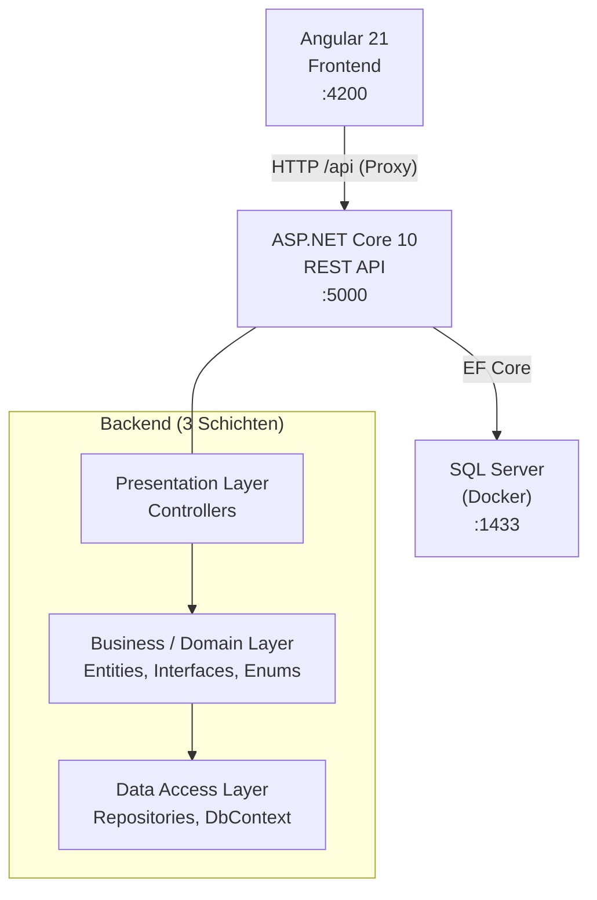
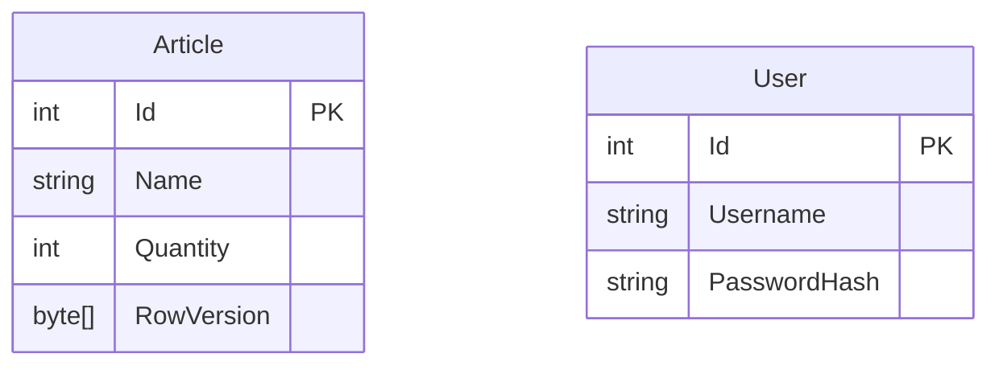
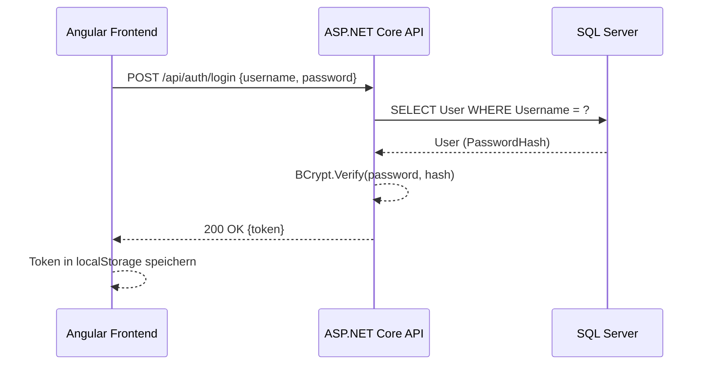
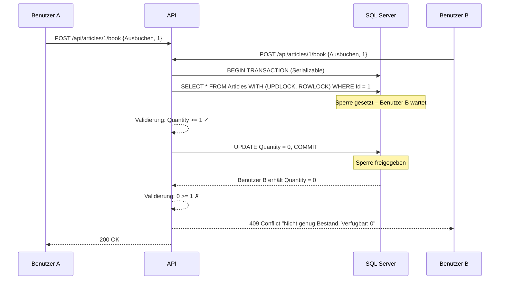

# LB223 – Lagerbestandssystem

> Multi-User-Applikation zur Verwaltung von Lagerbeständen. Mehrere Benutzer können gleichzeitig Artikel ein- und ausbuchen, wobei der Bestand durch Transaktionen und pessimistisches Locking jederzeit konsistent bleibt.

---

## Inhaltsverzeichnis

- [Übersicht](#übersicht)
- [Architektur](#architektur)
- [Datenmodell (ERD)](#datenmodell-erd)
- [API-Dokumentation](#api-dokumentation)
- [Wichtige Abläufe](#wichtige-abläufe)
- [Voraussetzungen](#voraussetzungen)
- [Installation & Start](#installation--start)
- [Testbenutzer](#testbenutzer)
- [Tests ausführen](#tests-ausführen)

---

## Übersicht

Das Lagerbestandssystem ermöglicht es mehreren gleichzeitigen Benutzern, Artikel einzusehen und deren Bestand zu buchen. Nach dem Login sieht jeder Benutzer die aktuelle Bestandsliste und kann pro Artikel eine Einbuchung (Bestand erhöhen) oder Ausbuchung (Bestand verringern) auslösen. Das System verhindert zuverlässig, dass der Bestand unter 0 fällt – auch wenn mehrere Benutzer exakt zur gleichen Zeit buchen (Lost-Update-Problem gelöst durch Serializable-Transaktion und UPDLOCK/ROWLOCK).

---

## Architektur



---

## Datenmodell (ERD)



`RowVersion` ist ein EF Core Concurrency Token, das automatisch bei jeder Änderung neu gesetzt wird.

---

## API-Dokumentation

Die vollständige interaktive Dokumentation ist über Swagger verfügbar: **`http://localhost:5000/swagger`**

| Methode | Endpoint | Auth | Beschreibung |
|---------|----------|------|--------------|
| POST | `/api/auth/login` | – | Login, gibt JWT zurück |
| GET | `/api/articles` | Bearer | Alle Artikel mit aktuellem Bestand |
| POST | `/api/articles/{id}/book` | Bearer | Artikel ein- oder ausbuchen |

**BookingRequest Body:**
```json
{
  "type": "Einbuchen",
  "amount": 5
}
```
`type` ist entweder `"Einbuchen"` oder `"Ausbuchen"`.

---

## Wichtige Abläufe

### Login



### Ausbuchen (Mehrbenutzer-Szenario)



---

## Voraussetzungen

- [.NET 10 SDK](https://dotnet.microsoft.com/download)
- [Node.js 24](https://nodejs.org/)
- [Docker Desktop](https://www.docker.com/products/docker-desktop/)

---

## Installation & Start

### 1. Repository klonen

```bash
git clone [Repository-URL]
cd lb223
```

### 2. Datenbank starten

```bash
docker run -e "ACCEPT_EULA=Y" -e "SA_PASSWORD=LB223_Dev!Pass" \
  -p 1433:1433 --name lb223-sql -d mcr.microsoft.com/mssql/server:2022-latest
```

### 3. Backend starten

```bash
cd backend/Api
dotnet run
```

Die API ist erreichbar unter: `http://localhost:5000`  
Swagger UI: `http://localhost:5000/swagger`

Migrationen und Seed-Daten (Artikel + Testbenutzer) werden beim Start automatisch angewendet.

### 4. Frontend starten

```bash
cd frontend/frontend
npm install
npm start
```

Das Frontend ist erreichbar unter: `http://localhost:4200`

---

## Testbenutzer

Die folgenden Benutzer werden beim ersten Start automatisch angelegt:

| Benutzername | Passwort |
|-------------|----------|
| `admin` | `Admin123` |
| `user1` | `User123` |
| `user2` | `User123` |

---

## Tests ausführen

Die Tests befinden sich in `backend/Tests/` und laufen gegen eine echte SQL Server Instanz (Port 1433 muss erreichbar sein).

```bash
cd backend
dotnet test
```

| Testklasse | Test | Beschreibung |
|---|---|---|
| `BookingUnitTests` | `ParallelAusbuchen_NurEineErfolgreich` | 2 parallele Ausbuchungen bei Bestand 1 → exakt 1 Erfolg |
| `BookingUnitTests` | `ParallelEinbuchen_AlleErfolgreich` | 5 parallele Einbuchungen → alle erfolgreich, Bestand = 5 |
| `LoadTests` | `LastTest_Ausbuchen_BestandNieUnterNull` | 10 parallele Ausbuchungen bei Bestand 5 → Bestand nie < 0 |
| `LoadTests` | `LastTest_Einbuchen_AlleErfolgreich` | 20 parallele Einbuchungen → alle erfolgreich, Bestand = 20 |

---

_Erstellt im Rahmen von Modul 223 – Laurin Monnerat – Mai 2026_
